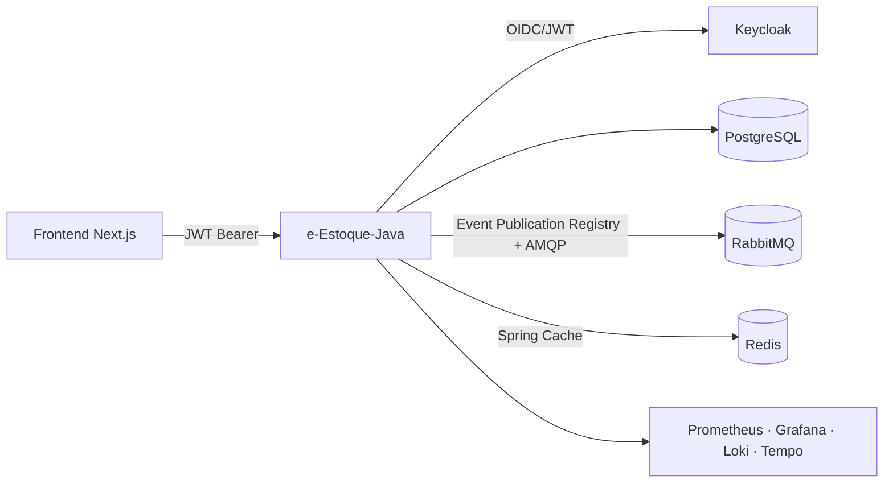

# e-Estoque-Java

Migração da **e-Estoque-API** (.NET 8 / C#) para **Java 25 + Spring Boot 4.1.1**, mantendo o contrato externo (endpoints, envelope JSON, códigos HTTP, eventos RabbitMQ) para que clientes existentes — inclusive o frontend Next.js — funcionem com o mínimo de alterações.

Especificação-antes-de-código (**SDD**): toda a derivação está em [`docs/sdd/`](docs/sdd/), com decisões em [`docs/adr/`](docs/adr/).

## Stack

| Camada | Tecnologia |
|---|---|
| Runtime | Java 25 (records, sealed interfaces, switch expressions, virtual threads) |
| Web | Spring Boot 4.1.1 · Spring MVC (imperativa) · springdoc-openapi 3.1 |
| Domínio | DDD + injeção direta de handlers (ADR-004 emendado) · Spring Modulith 2.1.1 |
| Persistência | Spring Data JPA + Hibernate + PostgreSQL 17 · Flyway |
| Segurança | Keycloak · Spring Security OAuth2 Resource Server (JWT, realm roles) |
| Mensageria | RabbitMQ (topic exchanges) + Event Publication Registry do Modulith (outbox transacional, ADR-012) |
| Cache | Spring Cache + Redis (somente referências, ADR-009) |
| Observabilidade | Actuator · Micrometer · Prometheus · OTLP (Tempo) · structured logging |

## Arquitetura

Modular monolith orientado a domínio:

```
io.github.mzet97.eestoque
├── shared        # kernel: Entity, eventos, exceções, envelope, parser gridify/OData, publisher do registry
├── identity      # Auth proxy Keycloak + resource server
├── company / customer / product (Product+Category) / inventory / tax / sales
└── (eventos: Event Publication Registry do Modulith — tabela "EVENT_PUBLICATION" no Postgres)
```

Cada módulo: `domain` (puro, sem Spring/Jackson) → `application` (commands/queries + handlers `@Transactional`) → `infrastructure` (JPA/AMQP) → `web` (controllers finos).



## Como executar

```bash
# Requisitos: JDK 25 (wrapper Maven incluso)
./mvnw clean verify          # build + unit + architecture tests

# Ambiente completo (requer .env baseado no .env.example)
cp .env.example .env
docker compose up -d --build
curl http://localhost:8081/actuator/health
```

Serviços: API `:8081` · Keycloak `:8080` (realm `e-estoque` importado; usuários `admin`/`usuario`) · RabbitMQ `:15672` · Redis `:6379` · Grafana `:3000` · Prometheus `:9090`.

### Testes

```bash
./mvnw test        # unitários + Modulith verify + ArchUnit + Instancio (sem Docker)
./mvnw verify      # + integração Testcontainers (PostgreSQL/RabbitMQ) quando houver Docker
```

Testes de integração usam `@Testcontainers(disabledWithoutDocker = true)` — em CI (com Docker) rodam 100% da suíte (NFR-TEST-002). `ArchitectureTest` (ArchUnit) fixa as regras de dependência entre camadas; `CategoryInstancioTest` (Instancio) gera dados aleatórios nos limites de validação .NET.

## Migração .NET → Java

Guia de equivalências e diferenças intencionais:

| .NET | Java |
|---|---|
| ASP.NET Core controllers | Spring MVC controllers finos |
| MediatR + pipeline behaviors | Handlers Spring injetados diretamente nos controllers, sem bus (ADR-004 emendado) |
| FluentValidation (entidades) | Validação de domínio com mensagens idênticas (`shared.domain.validation.Checks`) |
| EF Core + Migrations | Spring Data JPA + Flyway (`V1__baseline.sql` = schema .NET) |
| Keycloak.AuthServices | spring-boot-starter-security-oauth2-resource-server + conversor `realm_access.roles` |
| RabbitMQ.Client (fire-and-forget) | Event Publication Registry do Modulith + Spring AMQP (at-least-once, ADR-012) |
| Serilog → Loki | Logback estruturado + Micrometer Tracing → OTLP |
| OData + Gridify | Adapters próprios (subset, ADR-011) → Specifications |

Diferenças documentadas: [`docs/sdd/MIGRATION-DIFFERENCES.md`](docs/sdd/MIGRATION-DIFFERENCES.md) · Contratos: [`docs/sdd/05-API-CONTRACT.md`](docs/sdd/05-API-CONTRACT.md) · Parity: [`docs/sdd/API-PARITY.md`](docs/sdd/API-PARITY.md) e [`docs/sdd/DATABASE-PARITY.md`](docs/sdd/DATABASE-PARITY.md).

## Segurança

- Escritas (`POST/PUT/DELETE /api/**`) exigem a realm role **Create**; leituras exigem token válido; `/health` é anônimo.
- Nenhum secret no repositório — configure via `.env`/variáveis de ambiente.
- Lacuna conhecida do original (ausência de isolamento multi-tenant por Company) mantida por parity e documentada (SG-01 em MIGRATION-DIFFERENCES).
