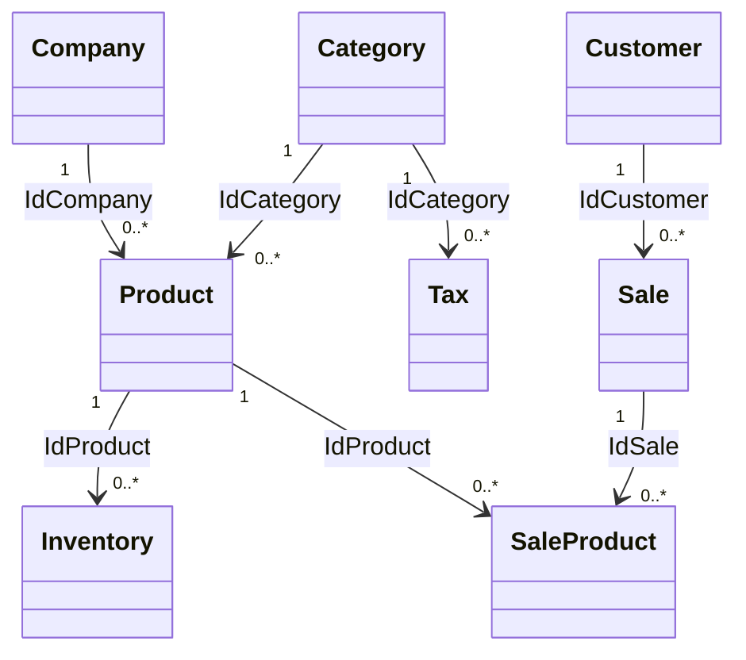

# 04 — DOMAIN MODEL

Derivado do código real (`e-Estoque-API.Core`). Nomenclatura preservada em inglês.

## Bounded contexts

| Módulo | Aggregate/Entities | Observações |
|---|---|---|
| product | Product (AR), Category (entidade compartilhada por tax) | Category usada por Product e Tax |
| inventory | Inventory | referência Product por id |
| sales | Sale (AR), SaleProduct (filho) | soft delete apenas aqui |
| customer | Customer + CustomerAddress (VO) | |
| company | Company + CompanyAddress (VO) | |
| tax | Tax | referência Category |
| identity | User/Token (sem entidade local; Keycloak é o sistema de registro) | |

## Diagrama de relacionamentos (corrigido pelo código real)

Todas as FKs `ClientSetNull` (sem cascade no banco). Toda entidade herda: `id (UUID), createdAt, updatedAt?, deletedAt?, isDeleted`.

## Value objects

- `CompanyAddress` / `CustomerAddress`: street, number, complement, neighborhood, district, city, country, zipCode, latitude, longitude — todos `String` obrigatórios (validação 3–80).

## Invariantes (FluentValidation .NET → domain validation Java)

Comum a todas (EntityValidation): id ≠ UUID vazio; createdAt entre 1900-01-01 e 3000-12-31; updatedAt/deletedAt nulos ou no mesmo intervalo.

| Entidade | Invariantes adicionais (mensagens exatas preservadas no Java) |
|---|---|
| Category | name 3–80; shortDescription 3–500; description 3–5000; todas `The {prop} needs to be provided` / `need to have between {min} and {max} characters` |
| Product | name 3–250; description 3–500; shortDescription 3–250; price/weight/height/length > 0; image 3–5000; idCategory/idCompany ≠ null |
| Company | name/docId 3–80; email/description 3–250; phoneNumber 3–80; address não nulo; campos address 3–80 (latitude 3–80, longitude sem regra) |
| Customer | idêntico a Company (customerAddress) |
| Inventory | quantity > 0; dateOrder obrigatória; idProduct obrigatório |
| Tax | name 3–80; description 3–250; percentage 0–100 |
| Sale | quantity > 0; saleType/paymentType definidos; totalPrice > 0; totalTax > 0; deliveryDate/saleDate/paymentDate obrigatórias (validação exige não-default); idCustomer obrigatório |
| SaleProduct | idProduct ≠ vazio; idSale ≠ vazio |

Estados/observações:
- `Disabled()` → isDeleted=true, deletedAt=now; `Activate()` → isDeleted=false, deletedAt=null; `Update()` → updatedAt=now. Chamam Validate().
- Eventos registrados no aggregate (lista), publicados pelo handler de aplicação após persistir.

## Eventos de domínio (payload = campos do evento)

`CategoryCreated/Updated`, `ProductCreated/Updated`, `CompanyCreated/Updated`, `CustomerCreated/Updated`, `InventoryCreated/Updated`, `SaleCreated/Updated`, `TaxCreated/Updated` — payload inclui campos de negócio (+ id); Sale inclui lista de produtos. Ver 08-EVENT-MODEL.
