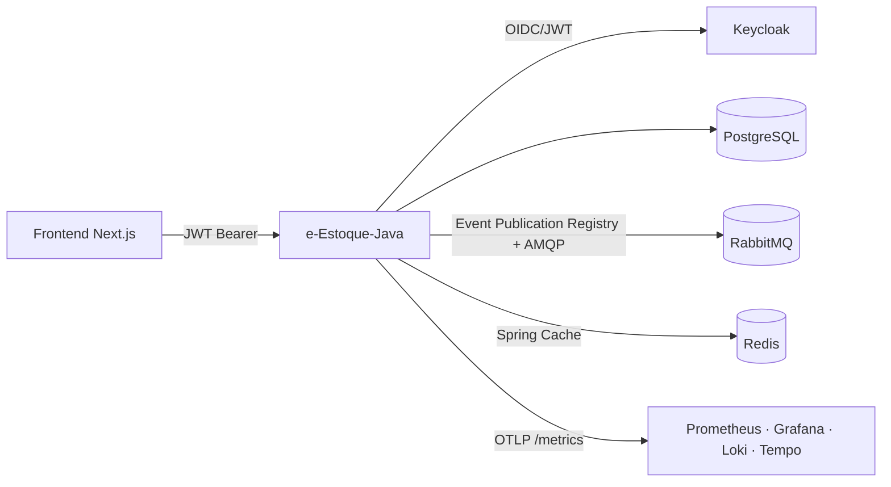

# 09 — ARCHITECTURE

Modular monolith orientado a domínio (Spring Boot 4.1.1 MVC + Spring Modulith 2.1.1), evoluível a microsserviços. Stack imperativa (JPA/JDBC bloqueante) + virtual threads habilitados (ADR-008 documentará a decisão com benchmarks básicos).

## Layout de pacotes

```
io.github.mzet97.eestoque
├── EEstoqueApplication
├── shared/                  # shared kernel: erros, envelope de resposta, paginação, clock, especificações, gridify
│   ├── domain   (Entity base, eventos + NotificationEvent, exceções de domínio, validação)
│   ├── application (ports CommandHandler/QueryHandler, parsers gridify/OData, paginação PagedResult, BaseResult)
│   └── infrastructure/web (Envelope serializer, ApiExceptionHandler, ODataCollection; messaging: publisher do registry)
├── identity/                # Auth proxy Keycloak + resource server config
│   ├── application (LoginUser, RefreshToken, RegisterUser, SystemLogin use cases)
│   ├── infrastructure (KeycloakClient, SecurityConfiguration, KeycloakAuthoritiesConverter)
│   └── web (AuthController)
├── company/  ├── customer/  ├── product/ (Product + Category)  ├── inventory/  ├── tax/  └── sales
│   └── cada módulo:
│       ├── domain/        # agregado, VOs, regras, DomainEvent, portas de repositório
│       ├── application/   # commands/queries + handlers (@Transactional), portas
│       ├── infrastructure/ # JPA adapter (entity+repository impl), cache
│       └── web/           # controllers finos, requests/responses (records), OData adapter
└── (eventos: Event Publication Registry do Modulith — tabela "EVENT_PUBLICATION" via Flyway V2)
```

## Regras de dependência (verificadas por `ApplicationModules.verify()` + ArchUnit)

1. `domain` não depende de Spring Web, Jackson, AMQP, Redis, Keycloak nem de outros módulos (exceto shared.domain).
2. `application` depende de `domain` + ports; não de `web`/`infrastructure`.
3. `web` só fala com `application` (handlers injetados diretamente; nunca JPA/EntityManager).
4. Módulos de negócio não importam pacotes internos uns dos outros — comunicação via eventos de aplicação quando necessário (no sistema original não há chamada entre contextos).
5. Fluxo: `HTTP → Controller → Command/Query → Handler(@Transactional) → Domain → Repository Port → JPA Adapter`.

## CQRS

- `Command<R>` / `Query<R>` (sealed interfaces) + handlers como beans Spring **injetados diretamente nos controllers** — sem bus de mediação (ADR-004 emendado: o despacho por tipo foi removido por não ter análogo idiomático no Spring).
- Cross-cutting: `@Transactional` nos handlers de command; validação de entrada por Bean Validation nos records de request; invariantes no domínio (validadores porta-on, mensagens idênticas ao .NET).
- Pipeline behaviors equivalentes: logging de exceção (UnhandledException) via `@RestControllerAdvice` + Micrometer.

## Observabilidade

Actuator + Micrometer (runtime, HTTP, JDBC pool) + Micrometer Tracing → OTLP (Tempo/Jaeger) + Prometheus registry; Logback structured (ECMAScript? não — logstash-style console + Loki-ready labels); métricas de negócio: `eestoque.sales.created`, `eestoque.sales.deleted`, `eestoque.inventory.low`, `eestoque.events.published{exchange}`.

## Componentes de infraestrutura

PostgreSQL (Flyway), RabbitMQ (externalização do Event Publication Registry — Modulith), Redis (Spring Cache, seletivo — ADR-009), Keycloak (IdP externo), Prometheus/Grafana/Loki/Tempo (compose), Nginx LB (compose dev parity).

## Diagrama


